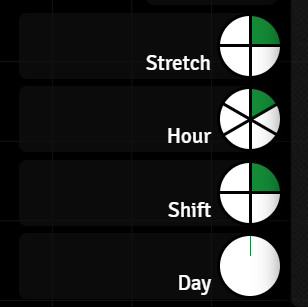

# Dragonbane Timekeeping

***Dragonbane Timekeeping***, or ***DB Time*** for short, is a collection of script macros for the [Foundry VTT](https://foundryvtt.com/). It implements simple timekeeping for the [Dragonbane game system](https://foundryvtt.com/packages/dragonbane) on top of the [Global Progress Clocks](https://foundryvtt.com/packages/global-progress-clocks) module.

These scripts have the following main features:

- They track the time in stretches and shifts, and optionally in hours and days as well.
- Since the time is stored in the Global Progress Clocks module data, it is persistent in your world and automatically shared with all players.
- They can tell the time in hours and minutes, posting the time as a chat message.
- They provide entry points for easy customisation, as well as some examples of more complex automations that can be driven by this system (but are not actually part of the core DB Time system):

  - Automatically posting the time of day to chat at the start of each hour, or shift
  - Automatically updating the scene lighting at dawn and sunset

I had a few goals when creating this system:

- The GM is always in control. While these scripts help keep track of the passage of time, they never decide what the time is. That's the GM's job.
- They should be simple to use. Once the clocks are created and the scripts are copied over, this system is very easy to run. Click a button in the macro toolbar to advance time by a stretch, or by a shift. If your party take a shift rest and you have rolled a random encounter, you can easily create a "half shift" macro that will advance time by half a shift. Drag that to the macro toolbar and you have a single-click half-shift button.
- They should be simple to customise. Out of the box, the scripts already do the stuff that I find useful - track time, tell the time, and allow customisation.
- Learn me some JavaScript. While I have a decent amount of software engineering experience, I have very little JavaScript experience, and even less with the Foundry API.

## Dependencies

- Foundry VTT Version 12 or higher
- [Global Progress Clocks](https://foundryvtt.com/packages/global-progress-clocks)

This is an essential requirement. The timekeeping scripts will fail to run without this module present and configured. Install Global Progress Clocks before moving on to the installation of Dragonbane Timekeeping.

## Installation

This is not a module, but a collection of scripts. While I've tried to make it as easy to use as possible, you will need to be familiar with creating script macros in Foundry to install this. One day I might create a module based on this work, but for now, it's all script macros.

### Step One

Before copying the macros over from the GitHub repository, you need to create your clocks using the Global Progress Clocks UI. Two clocks are essential - one for tracking the current stretch, and one for tracking the shift. Two optional clocks are also supported for tracking hours and days. If you want to track hours or days, then create clocks for them too. If you don't care about them, don't create the clocks. The scripts check for which clocks you create and work out what to do based on that. It's almost that simple.

Almost.

There is just one thing to consider. If you want to have a clock for hours that sits in between stretches and shifts, then your stretch clock needs to have just 4 sections, and the hour clock will have 6 sections. Together they make up the 24 stretches in a shift. If you don't want hours in a clock, just make a stretch clock with all 24 sections. This table shows the clocks, their required names and the numbers of sections.

| Clock Name | Number of Sections | Optional |
|---|---|---|
| Stretch | 24 (if you **don't** have an Hour clock)| No |
| Stretch | 4 (if you **do** have an Hour clock)| No |
| Hour | 6 | Yes |
| Shift | 4 | No |
| Day | 128 | Yes |

And don't worry if you get the clocks wrong. The script will complain if a clock has the wrong number of sections and if it can't find the Stretch or Shift clocks. But if you give the Hour or Day clocks the wrong name then the script won't complain, it will just behave as if they don't exist.

### Step Two

General points:

- How to copy the raw macro text
- Open the [Foundry Macro Directory](https://foundryvtt.com/article/macros/) and create a new folder called `DB Time`. Unlike the macro names, this folder name doesn't matter.

Now, one at a time, create script macros for every `.js` file in the [dbtime](./) folder in the Foundry `DB Time` macro folder you just created. I'll explain each of the files briefly here, although they all have extensive comments as well.

- [dbtime-engine](./dbtime-engine.js)
This is the implementation of DB Time. You can poke around in here if you want to see all the terrible things I've done to make this work, but you don't need to tinker with this file to use DB Time. You just need to copy it over and call it `dbtime-engine`. This is important. Many of the other macros search for `dbtime-engine` by name, so don't call it anything else.
- [dbtime-increment](./dbtime-increment.js) This one is simple. It calls the DB Time Engine and asks it to move the time forward by a number of stretches. You can create as many copies of this macro as you want, with different names that advance by different amounts of time. Inside the file I've given most of the common examples you might need. Set up the ones you want, give them memorable names, drag them to the macro toolbar, and that's your one-click button for controlling the time.
- [dbtime-set](./dbtime-set.js) Sets the time to exactly what you ask for. As is, it's a reset. Setting all the values to 1 sets time back to the first stretch of the first shift of the first day. Again, you can have lots of these if you need to set the time to different things. Maybe one day I'll make a dialog to do the same thing.
- [dbtime-tell-time](./dbtime-tell-time.js) Posts the current time of day in hours and minutes to chat.
- [dbtime/time-change-macros](./time-change-macros/)
