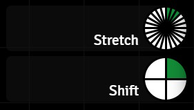

# Dragonbane Timekeeping

***Dragonbane Timekeeping***, or ***DB Time*** for short, is a collection of script macros for the [Foundry VTT](https://foundryvtt.com/). It implements simple timekeeping for the [Dragonbane game system](https://foundryvtt.com/packages/dragonbane) on top of the [Global Progress Clocks](https://foundryvtt.com/packages/global-progress-clocks) module.

These scripts have the following main features:

- They track the time in stretches and shifts, and optionally in hours and days as well.
- Since the time is stored in the Global Progress Clocks module data, it is persistent in your world and automatically shared with all players.
- They can tell the time in hours and minutes, posting the time as a chat message.
- They provide entry points for easy customisation, as well as some examples of more complex automations that can be driven by this system (but are not actually part of the core DB Time system):

  - Automatically posting the time of day to chat at the start of each hour, or shift
  - Automatically updating the scene lighting at dawn and sunset

I had a few goals when creating this system:

- The GM is always in control. While these scripts help keep track of the passage of time, they never decide what the time is. That's the GM's job.
- They should be simple to use. Once the clocks are created and the scripts are copied over, this system is very easy to run. Click a button in the macro toolbar to advance time by a stretch, or by a shift. If your party take a shift rest and you have rolled a random encounter, you can easily create a "half shift" macro that will advance time by half a shift. Drag that to the macro toolbar and you have a single-click half-shift button.
- They should be simple to customise. Out of the box, the scripts already do the stuff that I find useful - track time, tell the time, and allow customisation.
- Learn me some JavaScript. While I have a decent amount of software engineering experience, I have very little JavaScript experience, and even less with the Foundry API.

## Dependencies

- Foundry VTT Version 12 or higher
- [Global Progress Clocks](https://foundryvtt.com/packages/global-progress-clocks)

> [!IMPORTANT]
> **Global Progress Clocks is an essential requirement.** The timekeeping scripts will fail to run without this module present and configured. Install Global Progress Clocks before moving on to the installation of the Dragonbane Timekeeping scripts.

## Installation

This is not a module, but a collection of scripts. While I've tried to make it as easy to use as possible, you will need to be familiar with creating script macros in Foundry to install this. One day I might create a module based on this work, but for now, it's all script macros.

### Step One

Before copying the macros over from the GitHub repository, you need to create your clocks using the Global Progress Clocks UI. Two clocks are essential - one for stretches, and one for shifts. Clocks for hours and days are optional. If they are there, they will be used and if they are left out, they'll be ignored. It's almost that simple.

Almost.

The hours clock adds a slight complication. If you want to show hours, then your stretch clock needs to have just 4 sections, while the hour clock will have 6 sections. Together they make up the 24 stretches in a shift. Without the hour clock, the stretch clock has 24 sections. This table shows the clocks, their required names and the numbers of sections.

| Clock Name | Number of Sections | Optional |
|---|---|---|
| Stretch | 24 (if you **don't** have an Hour clock)| No |
| Stretch | 4 (if you **do** have an Hour clock)| No |
| Hour | 6 | Yes |
| Shift | 4 | No |
| Day | 128 | Yes |




>[!TIP]
> Don't worry if you get the clocks wrong. The script will complain if a clock has the wrong number of sections or if it can't find the Stretch or Shift clocks. But if you give the Hour or Day clocks the wrong name then the script won't complain, it will just behave as if they don't exist.

### Step Two

Open the [Foundry Macro Directory](https://foundryvtt.com/article/macros/) and create a new folder called `DB Time`. Unlike the macro names, this folder name doesn't matter.

Now, one at a time, create script macros for every `.js` file in the [dbtime](./) folder in the Foundry `DB Time` macro folder you just created. Copy the code for each macro from the file in the GitHub repo into your macro and save it. I'll explain what each of the files does here, although they all have extensive comments as well.

- [dbtime-engine](./dbtime-engine.js)
This is the implementation of DB Time. You can poke around in here if you want to see all the terrible things I've done to make this work, but you don't need to tinker with this file to use DB Time. You just need to copy it over and call it `dbtime-engine`. This is important. Many of the other macros search for `dbtime-engine` by name, so don't call it anything else.
- [dbtime-increment](./dbtime-increment.js) This one is simple. It calls the DB Time Engine and asks it to move the time forward by a number of stretches. You can create as many copies of this macro as you want, with different names that advance by different amounts of time. Inside the file I've given most of the common examples you might need. Set up the ones you want, give them memorable names, drag them to the macro toolbar, and that's your one-click button for controlling the time.
- [dbtime-set](./dbtime-set.js) Sets the time to exactly what you ask for. As is, it's a reset. Setting all the values to 1 sets time back to the first stretch of the first shift of the first day (6:00AM). Again, you can have lots of these if you need to set the time to different things. Maybe one day I'll make a dialog to do the same thing.
- [dbtime-tell-time](./dbtime-tell-time.js) Posts the current time of day in hours and minutes to chat.
- [dbtime/time-change-macros](./time-change-macros/) These are the macros where you can do your customisations. Along with `dbtime-engine`, their macro names in Foundry must exactly match the repository name, minus the `.js` extension. The four macros named after a clock - stretch, hour, shift, day - are called only when that clock changes the displayed value. The final macro - `dbtime-time-change` - is called whenever the time changes at all. Some of these have examples of their use, like posting the time to chat at the start of each hour or shift, or even automating changes to the scene light level based on the time of day. An important quirk to keep in mind is that `dbtime-hour-change` and `dbtime-day-change` are **only called** if the corresponding hour and day clocks are being used. There is example code in `dbtime-time-change` showing how to detect the start of the hour and day reliably in every situation.

## The Reckoning of Time

Dragonbane rules tell us that time is marked in stretches and shifts. A stretch is 15 minutes long, and a shift lasts for 6 hours. I've adhered to that, and from those numbers all the rest of the timekeeping follows. There are 4 stretches to an hour, 6 hours to a shift, and 4 shifts to a day.

For my own games, I've given the four shifts in a day names and beginning and end times of day, and I've used those in **DB Time**. I needed to make some assumptions in order to translate any given stretch and shift into a time of day, so I went with the system I was already using. Here's how it works, and how to read it from the Global Progress Shift clock:

| Shift     | Time Span           | Day or Night | 0-based Index | Display |
| -----     | ---------           | :----------: |:-----------: | :-----: |
| Morning   | 6:00 AM to 12:00 PM | Day | 0 | |
| Afternoon | 12:00 PM to 6:00 PM | Day | 1 | |
| Evening   | 6:00 PM to 12:00 AM | Night | 2 | |
| Night     | 12:00 AM to 6:00 PM | Night | 3 | |

Yes, this is different from the modern understanding that a new day starts at midnight. I don't care. People in my games are pragmatic, and their day starts at dawn when they get up to start the day. That's at 6am.

The example scene lighting system I've put into the `dbtime-time-change` macro implements dawn between 6AM and 7AM, and dusk between 6PM and 7PM each day. If you increment time forward by more than an hour and the dawn or dusk cycle is missed, it checks the scene lighting and just sets the darkness level directly to the correct day or night value.

## Automation

The time change macros receive the following objects in the `scope` variable:

- Two instances of a time object. One, `oldTime`, gives the previous time setting, and the other `time` gives the current time.

```yaml
time:
  stretch: number, the 0-based value of the stretch clock
  shift: number, the 0-based value of the shift clock
  hour: number, the 0-based value of the hour clock
  day: number, the 0-based value of the day clock
  time: string, the time of day formatted as a string in the form "h:MM AM/PM"
  totalStretches: number, the total number of stretches since stretch 0, shift 0, day 0
```

- A `constants` object containing a number of numeric constants that might be helpful if you need to do calculations.

```yaml
  STRETCHES_PER_HOUR: 4
  STRETCHES_PER_SHIFT: 24
  STRETCHES_PER_DAY: 96
  HOURS_PER_SHIFT: 6
  SHIFTS_PER_DAY: 4
  DAY_CLOCK_SEGMENTS: 128
  MINUTES_PER_DAY: 1440
```

## Other Games

While I wrote DB Time for Dragonbane, there's nothing in it that's actually specific to the Dragonbane rules. With a couple of tiny modifications these scripts can be used with nearly any other game. For example, I'm using it with the [Basic Fantasy Role-Playing Game](https://www.basicfantasy.org/index.html) with only the following changes to `dbtime-engine`:

```js
// BFRPG uses 10 minute turns, not 15 minute stretches. That's 6 per hour.
const STRETCHES_PER_HOUR = 6
const STRETCH_CLOCK_NAME = 'Turn'
```

With those two lines changed, I'll also need to make changes to the **Global Progress Clocks** I create in Foundry. Instead of a Stretch clock with 4 or 24 sections (depending on whether I have an hour clock or not), I now create a Turn clock with 6 or 36 sections, again depending on whether I have an hour clock. Everything else is the same. I still have the same 4 shifts in a day, and the time of day still just works.

The default settings in `dbtime-increment` will also be wrong, but only because the multiples of a turn that correspond to an hour, a shift, or a day are now different. Calculating the new values and updating the scripts is trivial. And `dbtime-increment` itself is still correct. It's faithfully incrementing the time by exactly the amount you ask for.

The sunrise and sunset code is slightly wrong, with those events now taking place over 40 minutes instead of 60. This is because I apply those events over a fixed number of stretches. That hardly matters and is easily fixed.
