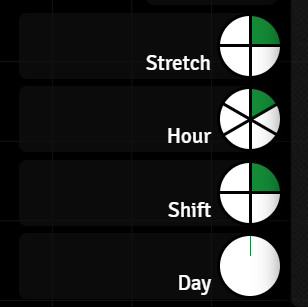

# Dragonbane Timekeeping

Overview

## Dependencies

- [Global Progress Clocks](https://foundryvtt.com/packages/global-progress-clocks)

This is an essential requirement. The timekeeping scripts will fail to run without this module present and configured. Install Global Progress Clocks before moving on to the installation of Dragonbane Timekeeping.

## Installation

This is not a module, but a collection of scripts. While I've tried to make it as easy to use as possible, you will need to be familiar with creating script macros in Foundry to install this. One day I might create a module based on this work, but for now, it's all script macros.

### Step One

Before copying the macros over from the GitHub repository, you need to create your clocks using the Global Progress Clocks UI. Two clocks are essential - one for tracking the current stretch, and one for tracking the shift. Two optional clocks are also supported for tracking hours and days. If you want to track hours or days, then create clocks for them too. If you don't care about them, don't create the clocks. The scripts check for which clocks you create and work out what to do based on that. It's almost that simple.

Almost.

There is just one thing to consider. If you want to have a clock for hours that sits in between stretches and shifts, then your stretch clock needs to have just 4 sections, and the hour clock will have 6 sections. Together they make up the 24 stretches in a shift. If you don't want hours in a clock, just make a stretch clock with all 24 sections. This table shows the clocks, their required names and the numbers of sections.

| Clock Name | Number of Sections | Optional |
|---|---|---|
| Stretch | 24 (if you don't have an Hour clock)| No |
| Stretch | 4 (if you do have an Hour clock)| No |
| Hour | 6 | Yes |
| Shift | 4 | No |
| Day | 128 | Yes |

And don't worry if you get the clocks wrong. The script will complain if a clock has the wrong number of sections and if it can't find the Stretch or Shift clocks. But if you give the Hour or Day clocks the wrong name then the script won't complain, it will just behave as if they don't exist.

### Step Two
