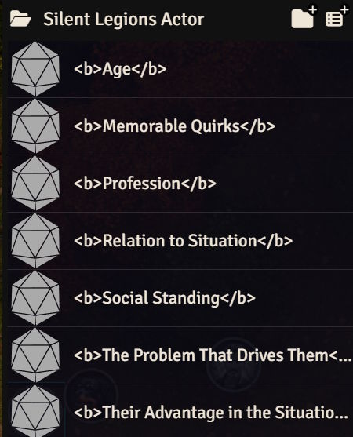
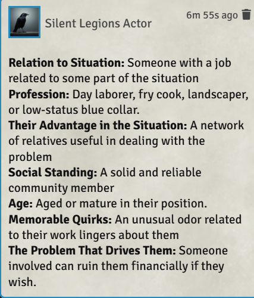

# Roll All In Folder

This Foundry macro calls all the rolltables in a folder once and formats the results into a chat message.

Given a folder of results like this:

It will produce output like:

It's not anything you can't do by rolling individually on all the tables, but it's a lot faster and more convenient.
Note that I won't be distributing any content for the tables. You'll need to own the books and supply your own.
